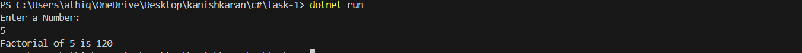

# Basic Data Types, Control Structures, and Methods

## 📝 Objective
Write a console application that calculates the factorial of a given number. The application should:
- Read an integer from the user.
- Validate the input to ensure it’s a positive integer.
- Use loops (or recursion) to calculate the factorial.
- Display the result in the console.

## 🧱 Structure
- **`Program.cs`**: Contains the main logic for input validation, factorial calculation, and output.

## ✅ Sample Run
Below is a screenshot of the console output during execution:

## 🧑‍💻 Code Highlights
- **Input Validation**: Ensures only positive integers are accepted.
- **Factorial Calculation**: Uses a `for` loop to compute the factorial.
- **Error Handling**: Handles invalid input gracefully.