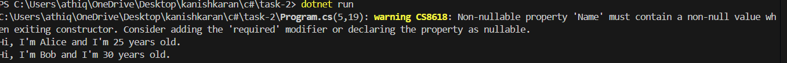

# Simple Object-Oriented Programming (OOP)

## 📝 Objective
Create a `Person` class with properties and methods. The application should:
- Define properties such as `Name` and `Age`.
- Implement a method `Introduce()` that prints a personalized greeting.
- Instantiate a few `Person` objects in the `Main` method and call `Introduce()` on each.

## 📦 Features
- **Class Definition**: Implements a `Person` class with properties and methods.
- **Encapsulation**: Demonstrates the use of properties to manage data.
- **Method Invocation**: Calls the `Introduce()` method to display personalized greetings.

## 🧱 Structure
- **`Person.cs`**: Contains the `Person` class definition.
- **`Program.cs`**: Contains the `Main` method where `Person` objects are instantiated and used.

## ✅ Sample Run
Below is a screenshot of the console output during execution:

## 🧑‍💻 Code Highlights
- **Class Properties**: Defines `Name` and `Age` with getters and setters.
- **Introduce Method**: Prints a personalized greeting using the `Name` and `Age` properties.
- **Object Instantiation**: Demonstrates creating and using multiple `Person` objects.