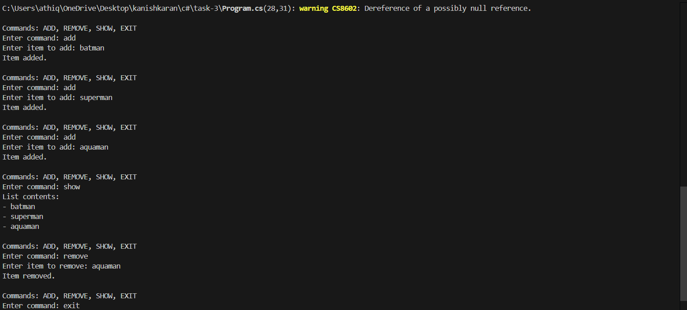

# Basic Collections and String Manipulation

## 📝 Objective
Write a program to manage a list of strings (e.g., names or tasks). The application should:
- Use a `List<string>` to store items.
- Allow the user to add, remove, and display items.
- Utilize loops and basic string methods (like `Trim()`, `ToUpper()`) to process user input.

## 📦 Features
- **Dynamic List Management**: Add, remove, and display items in a list.
- **String Manipulation**: Processes user input using methods like `Trim()` and `ToUpper()`.
- **User Interaction**: Provides a menu-driven interface for managing the list.

## 🚀 How to Run
1. Open the project in Visual Studio or any C# IDE.
2. Build and run the program.
3. Use the menu options to add, remove, or display items in the list.

## 🧱 Structure
- **`Program.cs`**: Contains the main logic for list management and user interaction.

## ✅ Sample Run
Below is a screenshot of the console output during execution:

## 🧑‍💻 Code Highlights
- **List Operations**: Uses `List<string>` to dynamically manage items.
- **String Methods**: Applies `Trim()` to clean input and `ToUpper()` for formatting.
- **Menu-Driven Interface**: Implements a loop to handle user commands interactively.