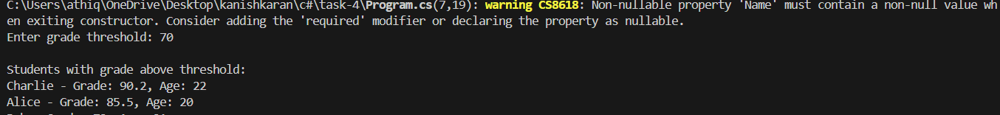

# Working with Collections and LINQ

## 📝 Objective
Create a student management console application. The application should:
- Define a `Student` class with properties such as `Name`, `Grade`, and `Age`.
- Populate a collection (e.g., a `List<Student>`) with sample data.
- Use LINQ to:
  - Filter students who have a grade above a certain threshold.
  - Sort the filtered results by name or grade.
- Display the filtered and sorted list.

## 📦 Features
- **Student Class**: Defines properties for `Name`, `Grade`, and `Age`.
- **LINQ Queries**: Filters and sorts students based on specific criteria.
- **Dynamic Data Display**: Outputs the filtered and sorted list to the console.

## 🧱 Structure
- **`Student.cs`**: Contains the `Student` class definition.
- **`Program.cs`**: Contains the main logic for populating the list, applying LINQ queries, and displaying results.

## ✅ Sample Run
Below is a screenshot of the console output during execution:

## 🧑‍💻 Code Highlights
- **Student Class**: Defines properties for storing student details.
- **LINQ Filtering**: Filters students with grades above a threshold using `Where`.
- **LINQ Sorting**: Sorts the filtered students by name or grade using `OrderBy` and `ThenBy`.
- **Console Output**: Displays the results in a readable format.