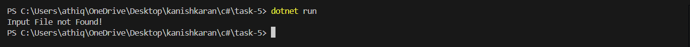
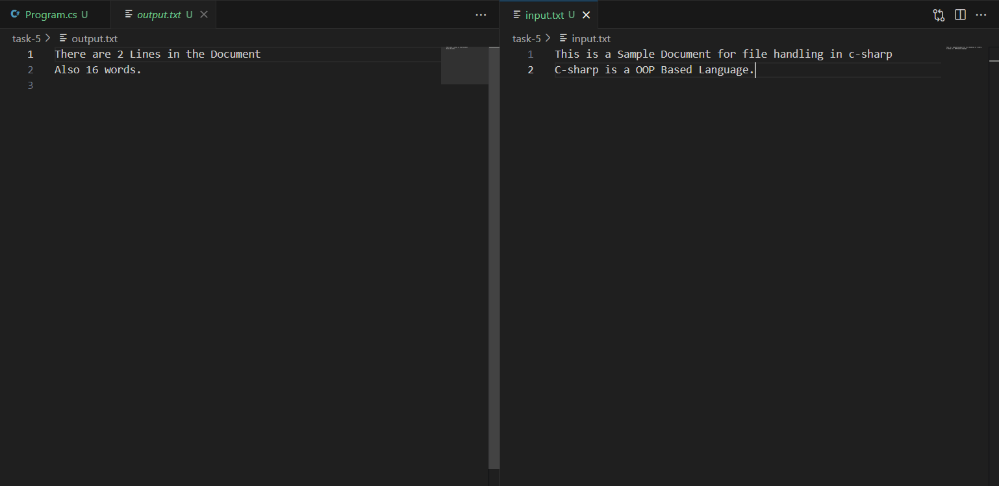

# File I/O and Exception Handling

## 📝 Objective
Develop an application that demonstrates file input/output operations and exception handling. The application should:
- Read text from a file (e.g., a log file or a simple CSV).
- Process the data (e.g., count words or lines).
- Write the result to a new file.
- Handle file-related errors such as `FileNotFoundException` or `IOException`.

## 📦 Features
- **File Reading**: Reads content from an input file.
- **Data Processing**: Counts the number of lines and words in the file.
- **File Writing**: Writes the results to an output file.
- **Exception Handling**: Manages errors like missing files or I/O issues.

## 🚀 How to Run
1. Place the input file (`input.txt`) in the project directory.
2. Open the project in Visual Studio or any C# IDE.
3. Build and run the program.
4. Check the output file (`output.txt`) for the results.

## 🧱 Structure
- **`Program.cs`**: Contains the main logic for file reading, processing, and writing.
- **`input.txt`**: Sample input file.
- **`output.txt`**: File where the results are written.

## ✅ Sample Run
Below is a screenshot of the console output during execution:

## 🧑‍💻 Code Highlights
- **File Reading**: Uses `File.ReadAllLines` to read the input file.
- **Word and Line Counting**: Processes the file content to count lines and words.
- **File Writing**: Writes the results to an output file using `StreamWriter`.
- **Error Handling**: Catches and handles `FileNotFoundException` and `IOException`.
