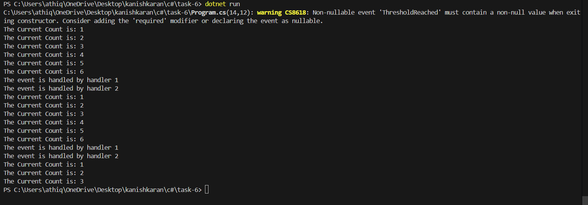

# Delegates, Events, and Basic Event Handling

## 📝 Objective
Build a console-based event-driven application that demonstrates the use of delegates and events. The application should:
- Define a delegate and an event that triggers when a counter reaches a specific threshold.
- Include multiple event handler methods to perform actions when the event is raised.
- Increment the counter in a loop and raise the event when the threshold is exceeded.
- Showcase how events decouple producer and consumer logic.

## 🚀 How to Run
1. Open the project in Visual Studio or any C# IDE.
2. Build and run the program.
3. Observe the console output as the counter increments and triggers events.

## 🧱 Structure
- **`Program.cs`**: Contains the main logic for the counter, event handling, and event handlers.

## 🧑‍💻 Code Highlights
- **Counter Class**: Defines the counter logic, threshold, and event.
- **Event Handlers**: Includes multiple methods to handle the event when triggered.
- **Main Loop**: Increments the counter and raises the event when the threshold is exceeded.

## ✅ Sample Run
Below is a screenshot of the console output during execution:

