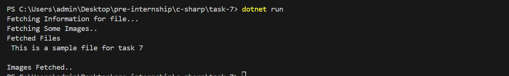

# Asynchronous Programming and Multi-threading

## 📝 Objective
Develop a console application that performs multiple asynchronous operations concurrently using `async` and `await`. The application should:
- Fetch data from multiple simulated sources (e.g., using `Task.Delay` to mimic API calls).
- Aggregate the results once all tasks are complete.
- Handle exceptions that may occur during asynchronous operations.

## 📦 Features
- **Asynchronous Operations**: Fetch data from multiple sources concurrently.
- **Task Aggregation**: Use `Task.WhenAll` to wait for all tasks to complete.
- **Exception Handling**: Gracefully handle exceptions during asynchronous operations.

## 🚀 How to Run
1. Open the project in Visual Studio or any C# IDE.
2. Build and run the program.
3. Observe the console output as it fetches data from simulated sources.

## 🧱 Structure
- **`Program.cs`**: Contains the main logic for asynchronous operations.
- **`Sample.txt`**: A sample file used to demonstrate file reading.

## ✅ Sample Run
Below is a screenshot of the console output during execution:

