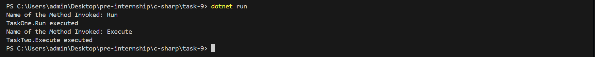

# Reflection and Custom Attributes in C#

## Objective
Build an application that discovers and executes methods based on custom attributes using reflection.

## Requirements
- Define a custom attribute (e.g., `[Runnable]`)
- Create classes with methods decorated with `[Runnable]`
- Use reflection to scan the current assembly for `[Runnable]` methods
- Dynamically invoke discovered methods and display their outputs

## How It Works
1. A custom attribute `[Runnable]` is defined and applied to specific methods.
2. Reflection is used to:
   - Scan all classes in the current assembly
   - Detect methods marked with `[Runnable]`
   - Dynamically instantiate the classes and invoke those methods
3. The output is printed to the console.

## Example Output
